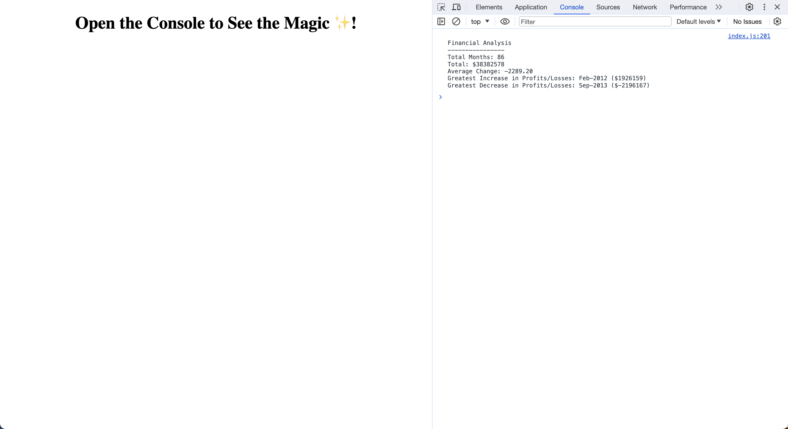

# console-finances
Unit 4 Challenge of EDX Bootcamp in Front End Web Development

<!-- TABLE OF CONTENTS -->

  
Table of Contents

  <ol>
    <li>
      <a href="#description">Description</a>
      <ul>
        <li><a href="#built-with">Built With</a></li>
      </ul>
    </li>
    <li>
        <a href="#installation">Installation</a>
    </li>
    <li><a href="#usage">Usage</a></li>
    <li><a href="#license">License</a></li>
    <li><a href="#contact">Contact</a></li>
    <li><a href="#acknowledgments">Acknowledgments</a></li>
  </ol>

<!-- ABOUT THE PROJECT -->
## Description

 
 
This was the 4th homework challenge for the EDX Bootcamp in Front End Development.
 

   
Our task was to create code for analyzing the financial records of a company. 

 

 
We were provided with an dataset of months and profits/losses in an array. We had to output:

 

* The total number of months included in the dataset.
* The net total amount of Profit/Losses over the entire period.
* The average of the changes in Profit/Losses over the entire period.
* The greatest increase in Profit/Losses (date and amount) over the entire period.
* The greatest decrease in Profit/Losses (date and amount) over the entire period.

### Built With

* 
* 

## Installation

N/A

<!-- USAGE EXAMPLES -->
## Usage

To use this project, please open the website in Chrome and then use developer tools to view the messages being logged in the console

Once dev tools is open, navigate to the Console tab at the top of the tools (you may need to click the double arrows first to see this option).

Users should now see the financial analysis being logged to the console.

Users can also inspect the JavaScript source file by going to the Sources tab in developer tools and then the index.js file.

<!-- LICENSE -->
## License

Distributed under the MIT License. See `LICENSE.txt` for more information.

<!-- CONTACT -->
## Contact

Richard Llewellyn - richard.lee.llewellyn@gmail.com 

Project Link: [https://richllew182.github.io/console-finances/](https://richllew182.github.io/console-finances/)

Project Repo Link: [https://github.com/RichLlew182/console-finances](https://github.com/RichLlew182/console-finances)

<!-- ACKNOWLEDGMENTS -->
## Acknowledgments

* [Img Shields](https://shields.io)
* [Best README Template](https://github.com/othneildrew/Best-README-Template)

